## Frameworks & Languages 


# 🎬 Movies App

<p align="center">
  
</p>

---

## Description
**Movies App** is a Flutter-based application that allows users to browse, search, and view movies.  
It uses **clean architecture** and **Cubit** for state management, and fetches live data from **[YTS API](https://yts.lt/api)**.  
The app is fully responsive using **MediaQuery & ScreenUtil**.

**Key Features:**
- Firebase Authentication (Login/Signup/Logout)
- Splash Screen & Onboarding
- Home Screen, Search, Browse, and Profile Tabs
- Movie Details Page with Trailer & WebView
- Download button for movies
- Responsive UI

---

## 🚀 Getting Started

### 📦 Dependencies

Main packages used in this project:

- [cupertino_icons](https://pub.dev/packages/cupertino_icons)
- [carousel_slider](https://pub.dev/packages/carousel_slider)
- [flutter_bloc](https://pub.dev/packages/flutter_bloc)
- [dio](https://pub.dev/packages/dio)
- [cached_network_image](https://pub.dev/packages/cached_network_image)
- [webview_flutter](https://pub.dev/packages/webview_flutter)
- [skeletonizer](https://pub.dev/packages/skeletonizer)
- [http](https://pub.dev/packages/http)
- [shimmer](https://pub.dev/packages/shimmer)
- [flutter_screenutil](https://pub.dev/packages/flutter_screenutil)
- [animated_text_kit](https://pub.dev/packages/animated_text_kit)
- [firebase_core](https://pub.dev/packages/firebase_core)
- [firebase_auth](https://pub.dev/packages/firebase_auth)
- [google_sign_in](https://pub.dev/packages/google_sign_in)
- [image_picker](https://pub.dev/packages/image_picker)
- [firebase_storage](https://pub.dev/packages/firebase_storage)
- [cloud_firestore](https://pub.dev/packages/cloud_firestore)
- [font_awesome_flutter](https://pub.dev/packages/font_awesome_flutter)
- [shared_preferences](https://pub.dev/packages/shared_preferences)
- [quickalert](https://pub.dev/packages/quickalert)

---

### 🛠 Dev Dependencies
- [flutter_test](https://pub.dev/packages/flutter_test)
- [flutter_lints](https://pub.dev/packages/flutter_lints)

---

### 💻 Installation

Run these commands in your terminal:

#### 1️⃣ Clone the Repository
```bash
git clone https://github.com/omarameen77/movies.git
```
#### 2. Cd Over
```bash
cd movies
```
#### 3 .Run Pub
```bash
flutter pub get
```
## Help

This app fetches live news articles from a public API using packages like http and dio.
Data is managed using Provider and ensuring smooth UI updates and performance.
If API requests fail, check your internet connection or the API endpoint in your project’s configuration.

## Authors

```bash
Omar Ameen
```
## Images


<p align="left">
  
  
  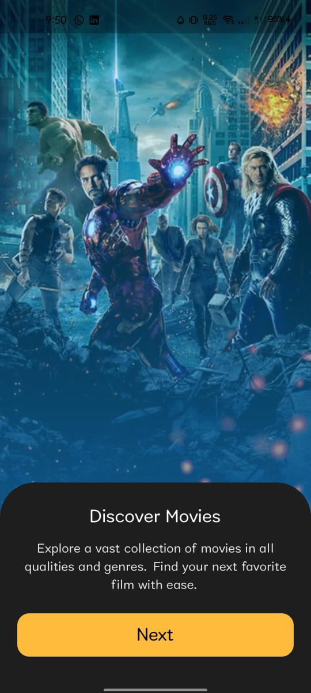
  
  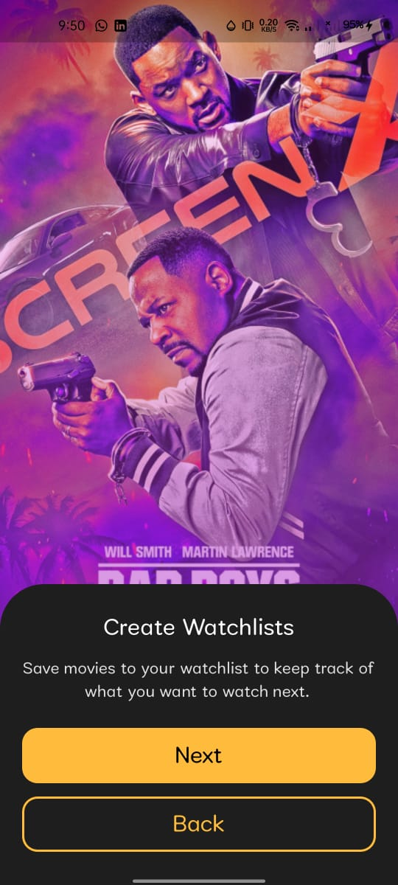
  
   
</p>
<p align="left">
  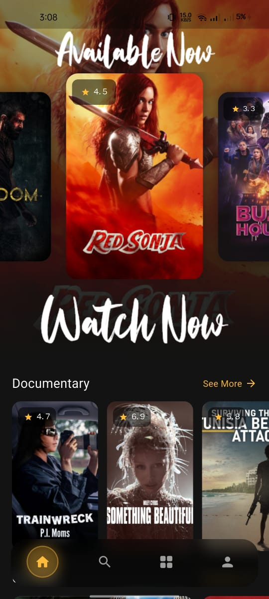
  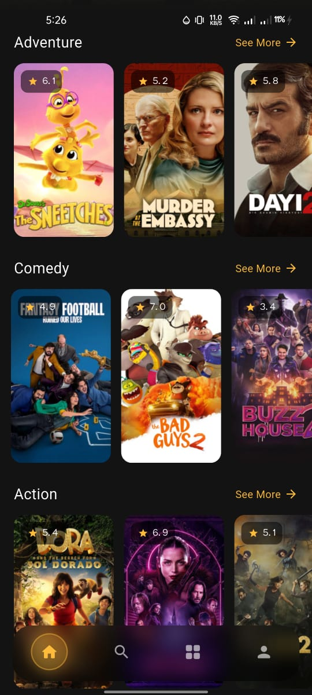
   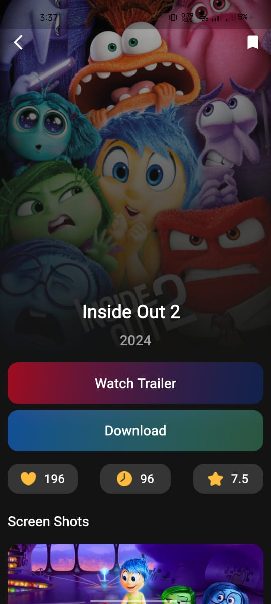
   
   
   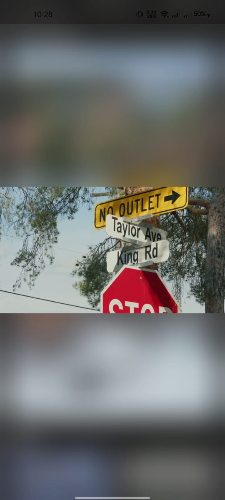
</p>
<p align="left">
 
   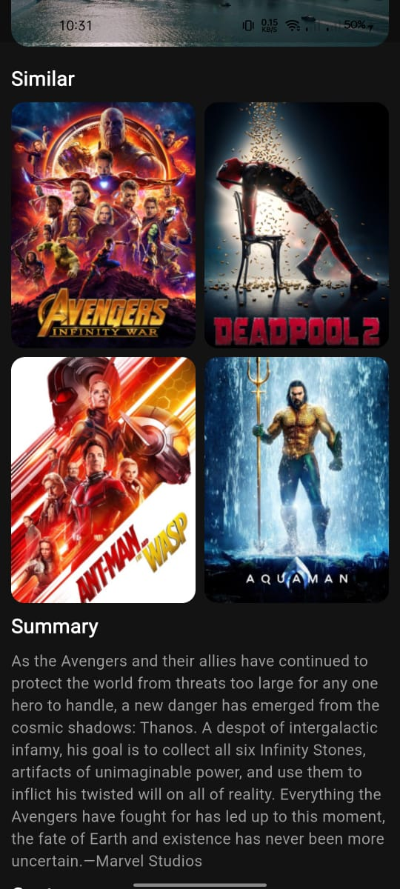
   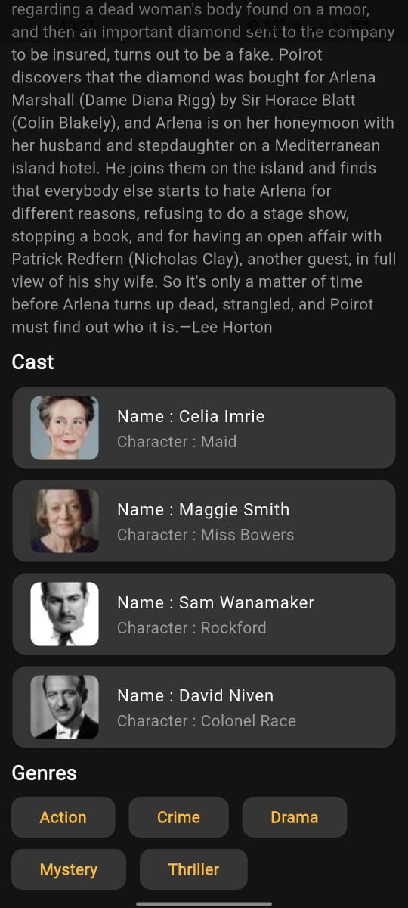
   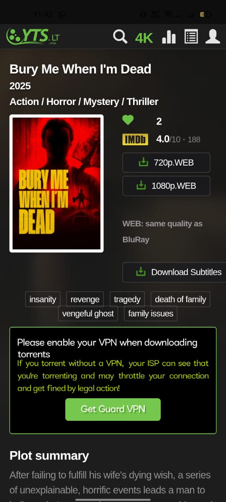
   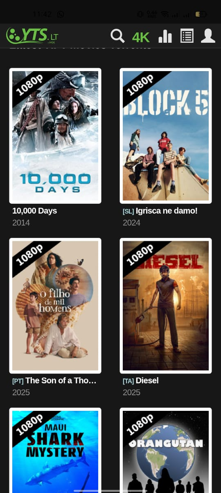
</p>
<p align="left">
   
   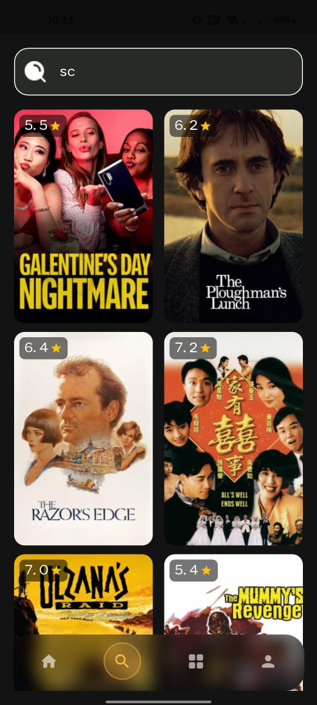
   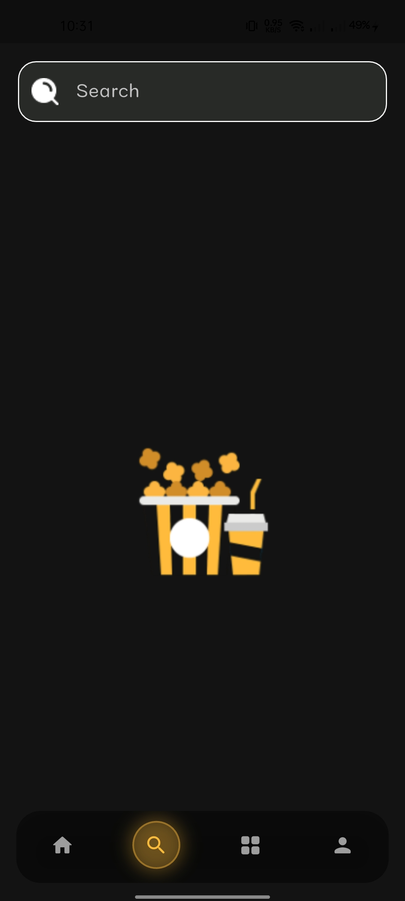
    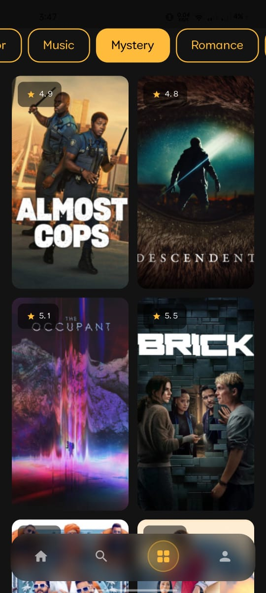
</p>
<p align="left">
   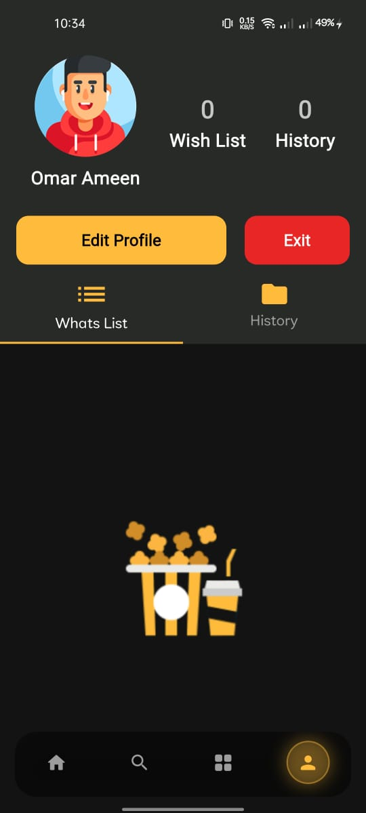
   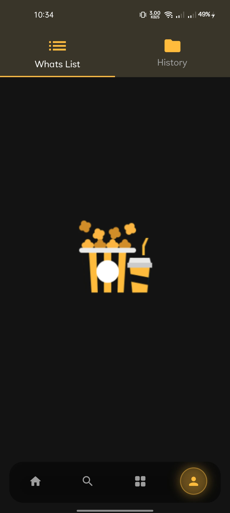
   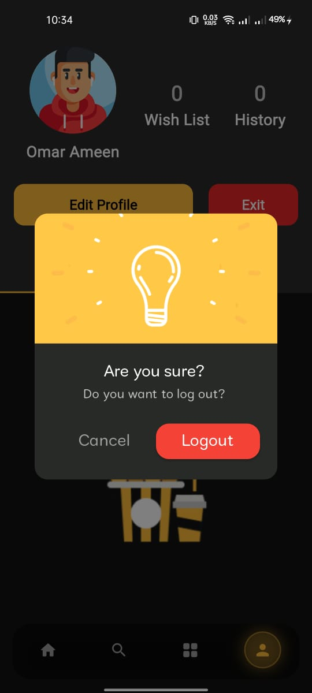
</p>
<p align="left">
 
</p>

